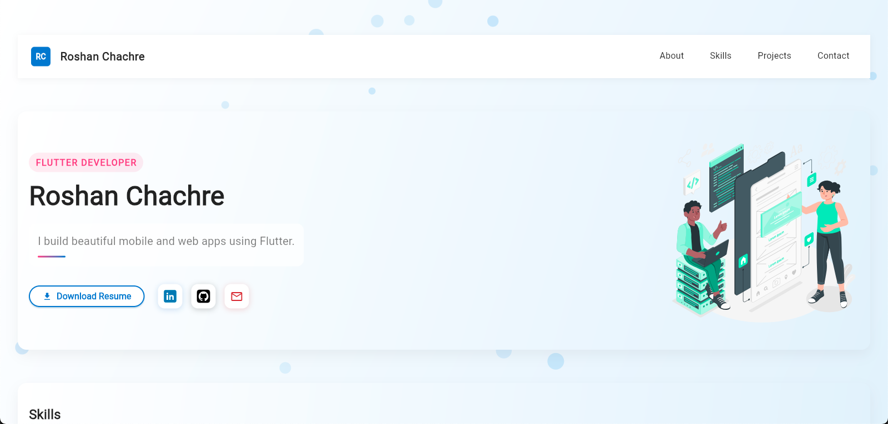

# Portfolio Website

A personal portfolio built with **Flutter** showcasing projects, skills, and experience.  
This portfolio is fully **responsive**, optimized for both **desktop web** and **mobile web** experiences, and includes **modern animations** for an interactive UI.

---

## ✨ Features
- **Responsive Design**: Works seamlessly across desktop and mobile browsers.
- **State Management**: Implemented using **Riverpod** for scalable and maintainable code.
- **SVG Support**: Smooth and scalable vector graphics using **flutter_svg**.
- **Custom Animations**: Engaging and interactive transitions to enhance user experience.
- **Web-Optimized**: Deployed and optimized for fast loading on browsers.

---

## 📸 Preview


*(Place your screenshot at `assets/portfolio_preview.png` in your repo)*

---

## 📦 Packages Used
- [flutter_riverpod](https://pub.dev/packages/flutter_riverpod) – State management
- [flutter_svg](https://pub.dev/packages/flutter_svg) – SVG image rendering
- [animations](https://pub.dev/packages/animations) – Flutter animation helpers

---

## 🚀 Getting Started

### Prerequisites
- Flutter SDK installed (Channel stable)
- Dart 3.0+

### Installation
```bash
# Clone the repository
git clone https://github.com/your-username/your-portfolio.git

# Navigate to project folder
cd your-portfolio

# Get dependencies
flutter pub get

# Run the app (Web)
flutter run -d chrome
